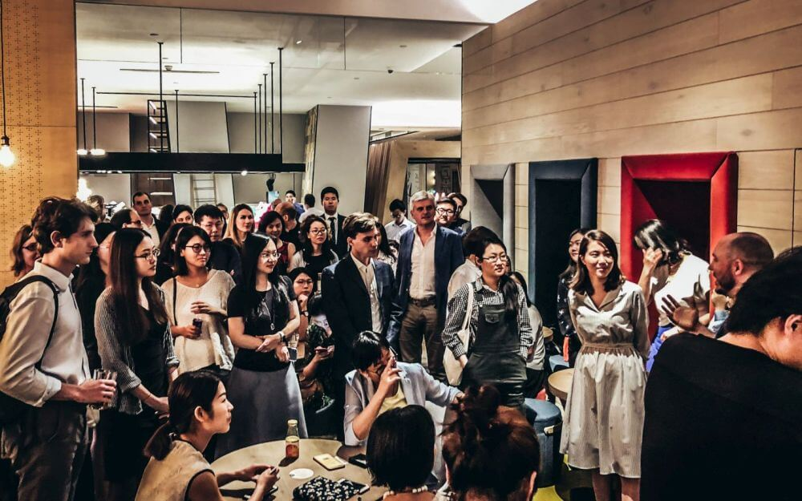
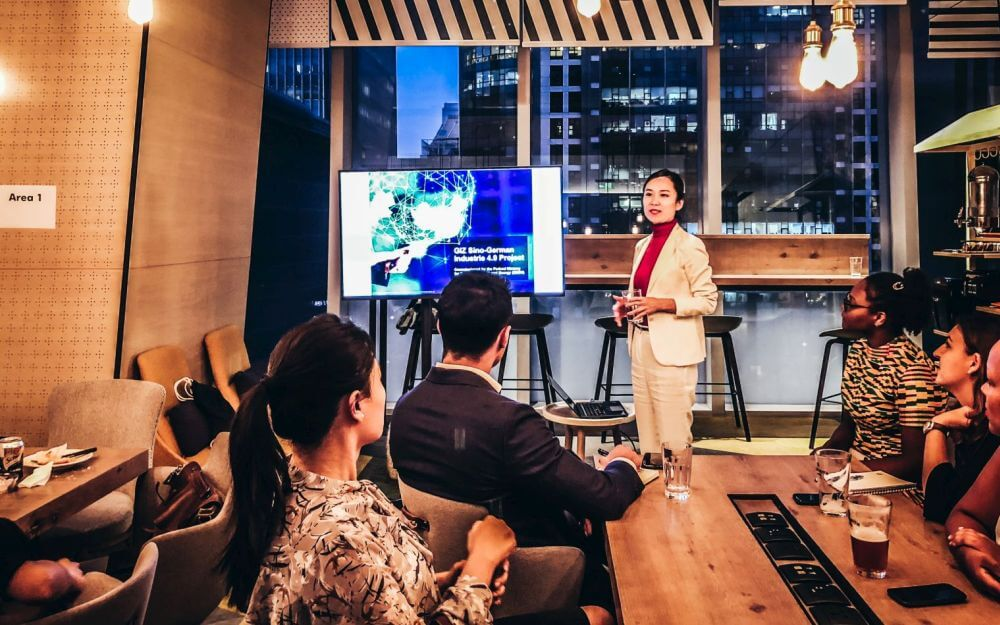
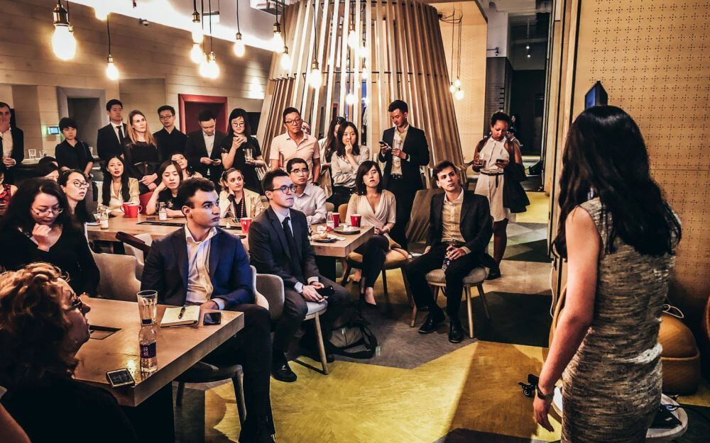
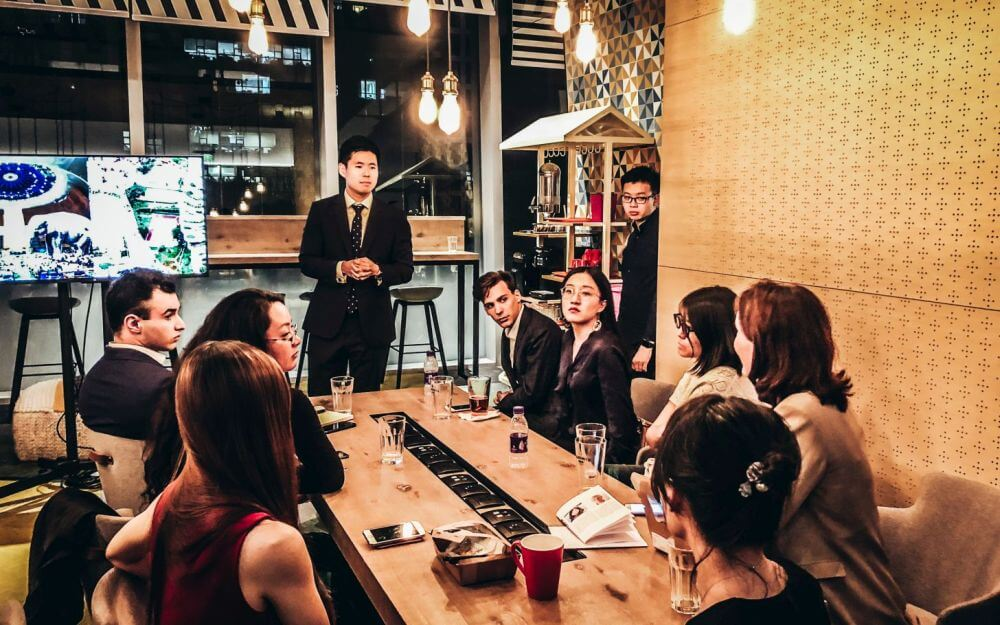
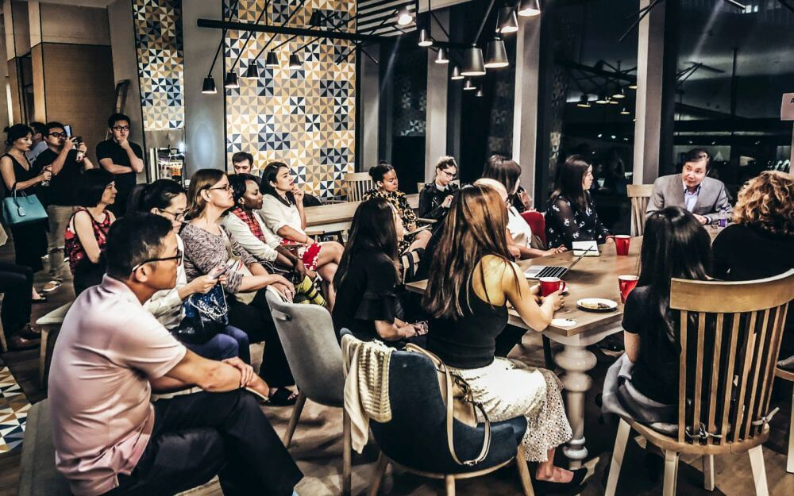
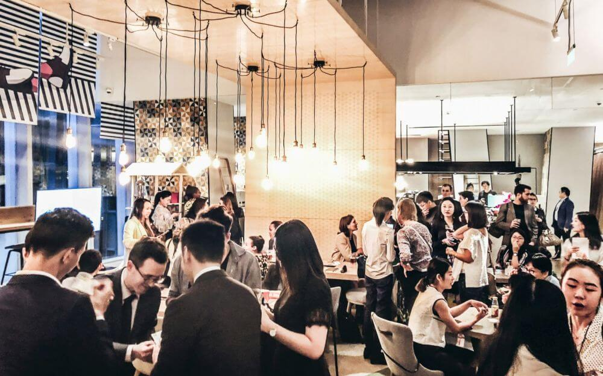
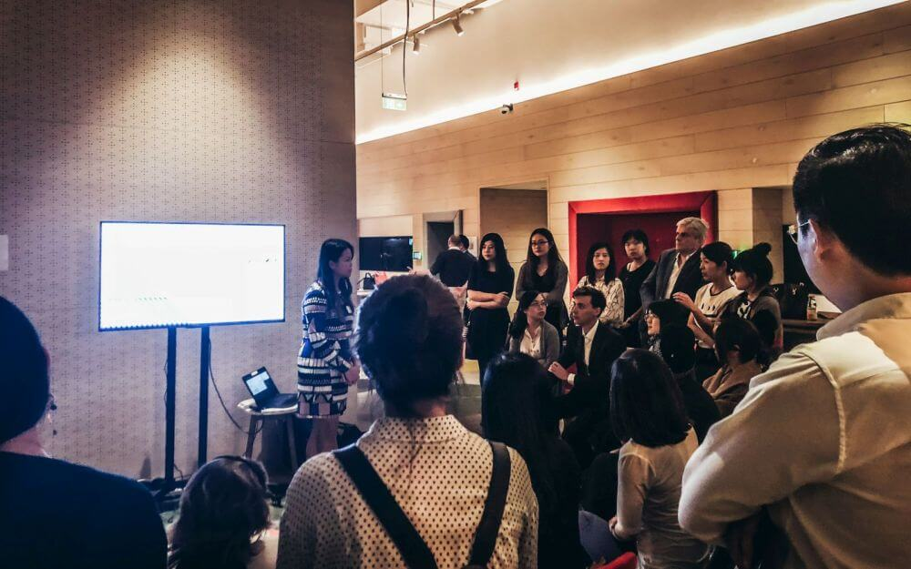
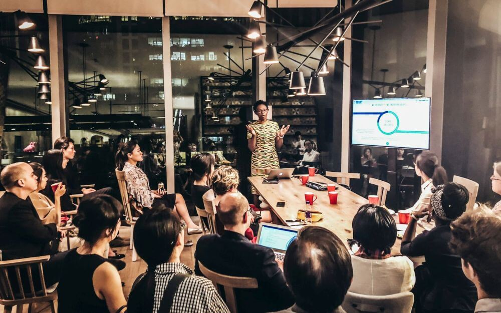
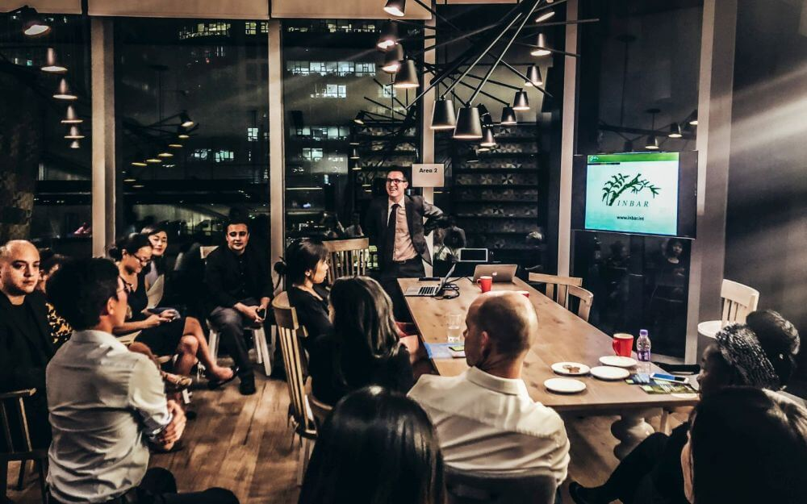
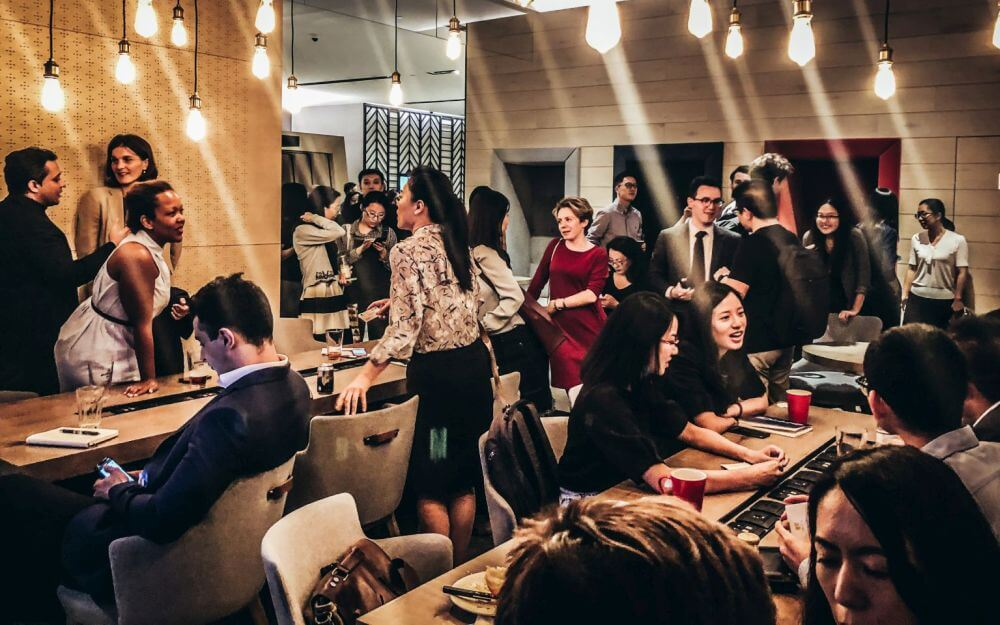

# Impact Sessions
_events and media that connects the impact community_

The Impact Sessions is an event series for professionals in the global development field. Since 2017, the series has organized monthly drinks with notable speakers from Beijing and the region to share insights and experience in multilateral institutions. The series brings together a network of multilateral banks, development agencies, non-profit partners and consultants to foster real long-term collaborations, and generate relevant industry content.

## May 10, 2018 - The First Impact Sessions Unconference

Our first Impact Sessions Unconference happened on May 10, 2018!

### Top 10 pictures

